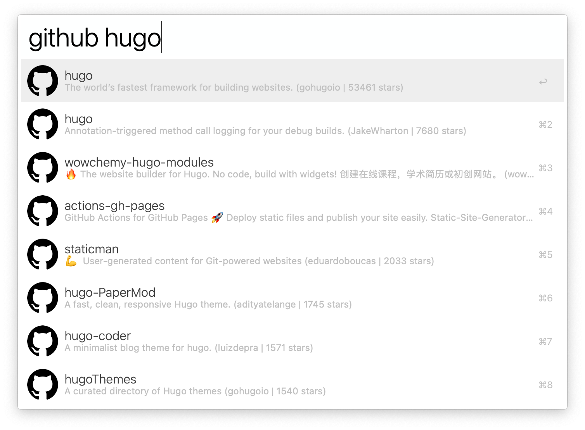

# Alfred Github Search

Alfred workflow to search for Github repository.

## Prerequisites

- The [deno](https://deno.land) runtime installed

## How to use

1. Open Alfred App
2. Type `github`
3. Pass an argument to a script (name of a repository)
4. Wait for results
5. Then:
    - `Return` to open on Github
    - `cmd + c` to copy clone link.
    - Hold `cmd` to open pull requests
    - Hold `alt` to open issues
